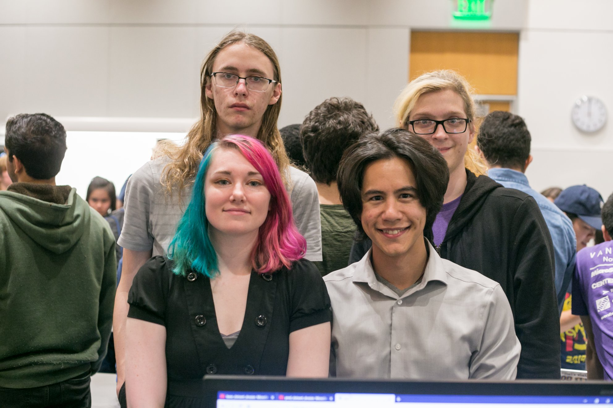
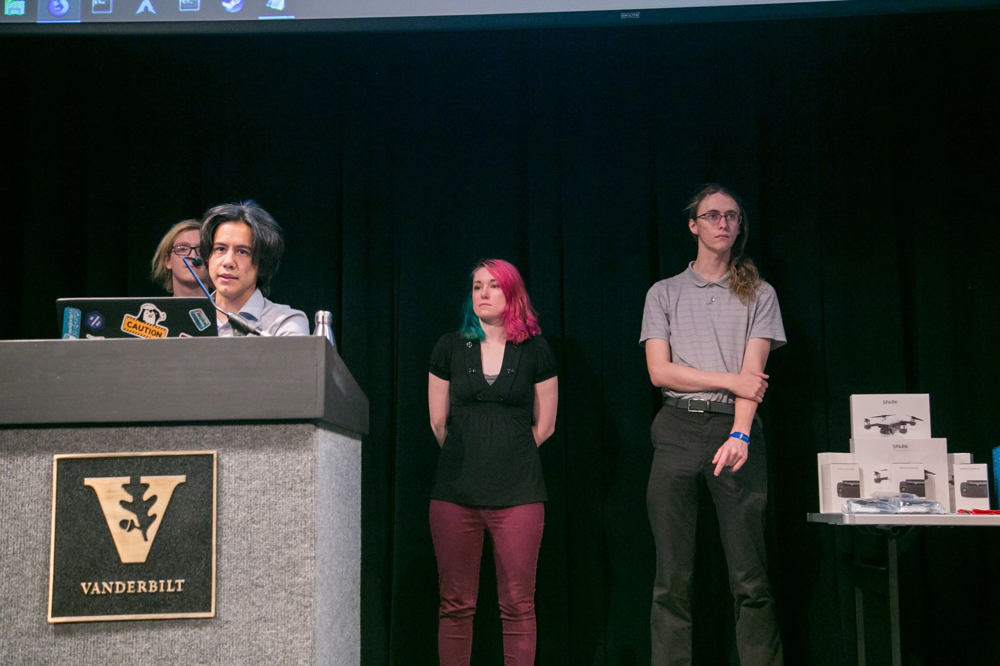
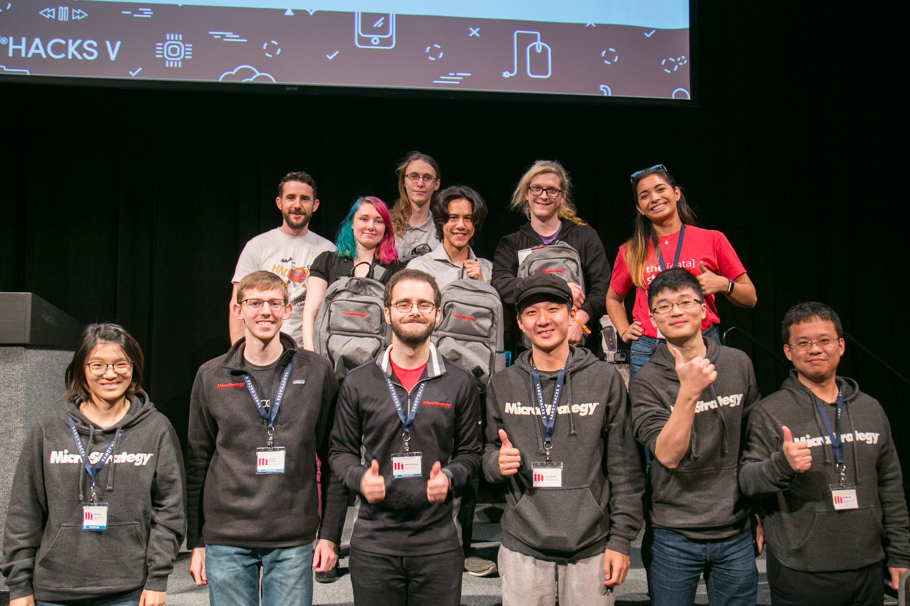
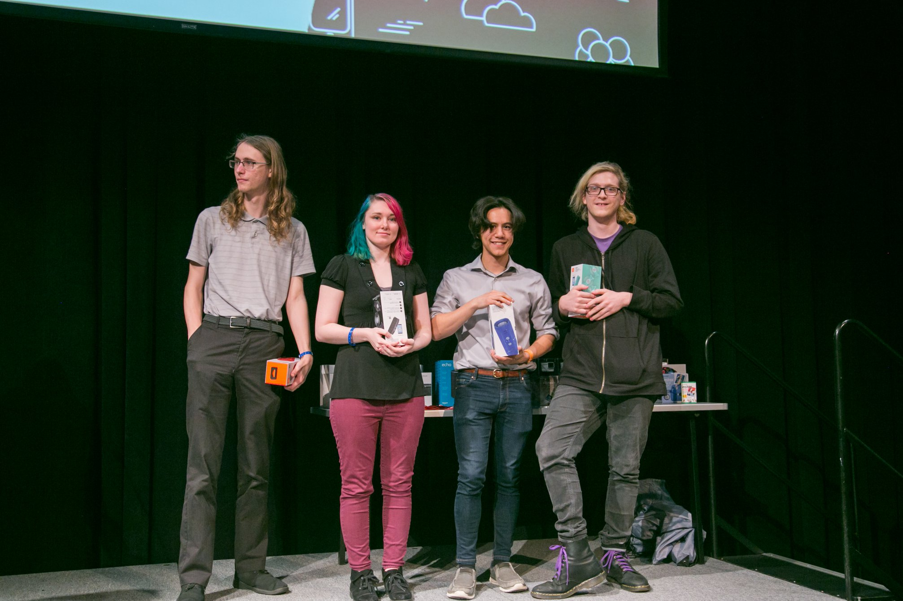

# vandyhacks2018

Group Members: Einar Strandberg, Steven Sheffey, Taylor Carrick, and Sam Remedios

Top 5 Speech Presentation

Best Use of MicroStrategy 

Prize: Nintendo Switch and Swag backpack with a notebook, t-shirt, and tumbler. Awarded to the best project utilizing the MicroStrategy API. 

Workshop Warrior

Prize: JBL Flip 4 Speaker. Awarded to the best hack utilizing a tool or tech taught in a workshop. Winners must have attended the corresponding workshop

Additional Information can be found at: https://devpost.com/software/taskmanager
